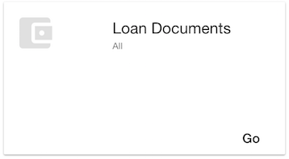

== Assignment 6

In this assignment, we're going to get the loans created in the system.
We will also apply a filter so that loans of a particular user are only fetched

=== API 
==== Request
[source,http]
GET /files?filter=traits.loan.id is not null HTTP/1.1
HOST: localhost:8080
authorization: bearer eyJh...
content-type: application/json

==== Response
[source,json]
{
    "_embedded": {
        "itemResourceList": [{
            "id": "6CLDBvf5BSddBojFslYZsf",
            "createTime": "2016-10-24T16:59:35.658+0000",
            "updateTime": "2016-10-24T17:55:23.657+0000",
            "createdBy": "bob@acme.com",
            "updatedBy": "bob@acme.com",
            "owner": "bob@acme.com",
            "etag": 4,
            "name": "Bob loan doc",
            "description": "Bob loan doc desc",
            "type": "file",
            "parentFolder": "9enlwyQo4UYfZkRfjWWniP",
            "acl": "92zAAs...",
            "chronicleId": null,
            "versionNo": 0,
            "versionLabel": ["INITIAL"],
            "lockOwner": null,
            "lockTime": null,
            "tags": null,
            "traits": {
                "loan": {
                    "loantrait": {
                        "zipcode": "34566",
                        "itemId": "6CLDBvf5BSddBojFslYZsf",
                        "firstname": "Bob",
                        "loanTerm": 18,
                        "city": "Bob city",
                        "addressLine1": "Bob address",
                        "addressLine2": "Bob ad",
                        "id": "lgl4N5G4xAqixynH4I4jMR",
                        "state": "Bob state",
                        "loanAmount": 18000.0,
                        "lastname": "Z"
                    }
                }
            },
            "renditions": [],
            "_links": {
                "self": {
                    "href": "http://localhost:8080/files/6CLDBvf5BSddBojFslYZsf"
                }
            }
        }]
    },
    "_links": {
        "self": {
            "href": "http://localhost:8080/files?filter=traits.loan.id%20is%20not%20null%20and%20owner%20=%20%27bob@acme.com%27"
        },
        "next": {
            "href": "http://localhost:8080/files?filter=traits.loan.id%20is%20not%20null%20and%20owner%20=%20%27bob@acme.com%27&page=2&items-per-page=10"
        },
        "last": {
            "href": "http://localhost:8080/files?filter=traits.loan.id%20is%20not%20null%20and%20owner%20=%20%27bob@acme.com%27&page=3&items-per-page=10"
        }
    }
}

=== View
In the application, this loans in the system are fetched when the logged in user navigates to the 'Documents' View
and clicks the 'Go' button in the card for 'Loan Documents'

`src/modules/content/content.html`
[source,html]
<md-button ng-click="vm.showLoans()">Go</md-button>

=== Controller
`src/modules/content/content.controller.js` +
In the content controller we load the loan resources in the following manner. Note that we pass across the user
to filter by only if it's not a role of a loan officer, so that the filter is applied only for certain roles

[source,javascript]
  showLoans() {
    var user = this.user;
    if(this.roles.includes('loan_officer')) {
      user = {};
    }
    this.contentService.fetchLoanDocuments(user).then( (items) => {
      this.showingLoanData = true;
      this.contentlist = items;
    })
  }

=== Service
==== Assignment:
The following function in the content service is to fetch and return the loans. Right now it returns empty.
Details of the required implementation are in the function comments

Location: `src/services/content.service.js`
[source,javascript]
    /**
     * TODO Assignment : Implement this method
     * Fetch the loan documents in the system
     *
     * 1. Get the url to get files in the system - /files (this.allContentEndpoint in this file)
     * 2. Fire an http GET to the url
     * 3. Tweak the url to now apply a filter for the loan trait
     * 3. Return the response data items (data._embedded.itemResourceList)
     *
     * @param user
     * @returns {*|Promise.<TResult>}
     */
    fetchLoanDocuments(user: Object = {}) {
        return this.$q.resolve([]);
    }
