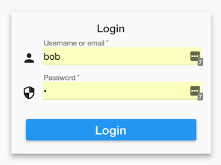
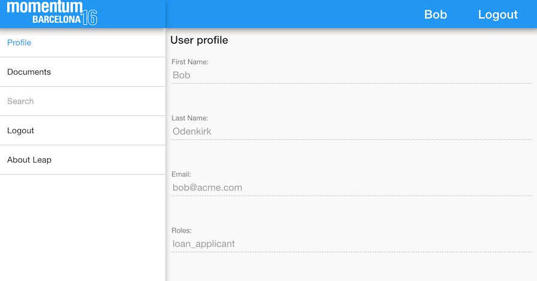
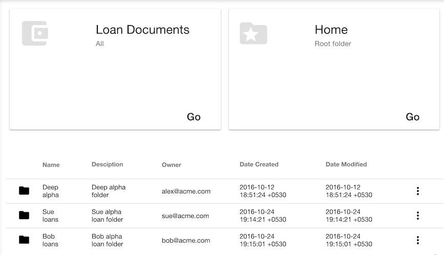
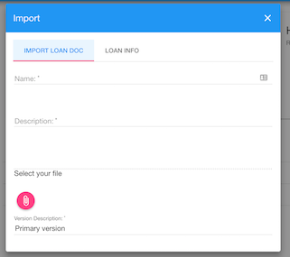
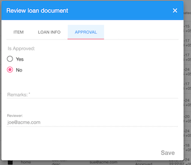

== Introduction

Welcome to the lab session on the LEAP platform APIs.
  We'll touch upon the functionality of the application we're going to tweak and highlight the technology used.

=== Key Concepts

* Folder - Container for sub-folders and files
** Root Folder - Top-level folder per tenant
* File - Document with content
* Object - Content-less objects
* Trait - Custom dynamic metadata
* ACL - Permissions granted to users and roles

=== Pre-defined Roles and Users

* Loan Applicant - Person applying for a loan
** Bob - token: `eyJhbGciOiJSUzI1NiIsInR5cCI6IkpXVCJ9.eyJjb250ZXh0Ijp7InVzZXIiOnsiaWQiOiIxIiwiZW1haWwiOiJib2JAYWNtZS5jb20iLCJmaXJzdE5hbWUiOiJCb2IiLCJsYXN0TmFtZSI6Ik9kZW5raXJrIiwicGhvbmUiOm51bGx9LCJzdWJzY3JpcHRpb25zIjpbeyJpZCI6IjEiLCJuYW1lIjoiYWNtZS1jbXMiLCJyb2xlcyI6WyJsb2FuX2FwcGxpY2FudCJdLCJza3VzIjpbeyJpZCI6IjEiLCJuYW1lIjoiVHJhaWwiLCJwYXJhbXMiOnsiRG9jdW1lbnQgQ291bnQiOiIxMDAwIn19XSwidGVuYW50Ijp7ImlkIjoiYWNtZSIsIm5hbWUiOm51bGx9LCJhcHBsaWNhdGlvbiI6eyJpZCI6ImNtcyIsIm5hbWUiOiJjbXMifX1dfSwiY2xpZW50X2lkIjoic2NvdHQiLCJleHAiOjE0Nzk2NDE5MDU4OTgsImp0aSI6IjFpbDFmcjZ0dXV3bHRRaE83UjVJZXciLCJzY29wZSI6WyJyZWFkIl0sImF1dGhvcml0aWVzIjpbXX0.cTIr8eyBelCKq10oCE9jBFoOI6WITLpRXsnwYDSOKkZ5JLFPyFklNAbY0BjRNvy1nxk6uIblFajM1ILFCy4yZg6XCOLhch9_LS5qivESgYK3HxyyrBpoxwMB7875Hs-Aci0JnNQpUCnMaUhVdUDhD2Q8PYaoghHKPJqm2oGLo_Gh48bg2UIBbpDr5blfp7EynlvP-ArOB1ZrCs2kdJQ4gmGQrYSKgGZV3HCUN19aVd_OyIgnqfD_bp9K1JyYUbYMj51WwzUhi9koU_c9jlpc9pDv3Ctx8RI2vqV9Iop4ka4hCBhZ7idYKYfdn_1FYyrZWevq321JfRvwPXf9WiGWVg`
* Loan Officer - Employee at the bank
** Joe - token: `eyJhbGciOiJSUzI1NiIsInR5cCI6IkpXVCJ9.eyJjb250ZXh0Ijp7InVzZXIiOnsiaWQiOiIxIiwiZW1haWwiOiJqb2VAYWNtZS5jb20iLCJmaXJzdE5hbWUiOiJKb2UiLCJsYXN0TmFtZSI6IkhhcnQiLCJwaG9uZSI6bnVsbH0sInN1YnNjcmlwdGlvbnMiOlt7ImlkIjoiMSIsIm5hbWUiOiJhY21lLWNtcyIsInJvbGVzIjpbImxvYW5fb2ZmaWNlciJdLCJza3VzIjpbeyJpZCI6IjEiLCJuYW1lIjoiVHJhaWwiLCJwYXJhbXMiOnsiRG9jdW1lbnQgQ291bnQiOiIxMDAwIn19XSwidGVuYW50Ijp7ImlkIjoiYWNtZSIsIm5hbWUiOm51bGx9LCJhcHBsaWNhdGlvbiI6eyJpZCI6ImNtcyIsIm5hbWUiOiJjbXMifX1dfSwiY2xpZW50X2lkIjoic2NvdHQiLCJleHAiOjE0Nzk2NDIwMzMyNDksImp0aSI6IjB1ZDJXRmRFNWFsYkx3WjZONzM2aUsiLCJzY29wZSI6WyJyZWFkIl0sImF1dGhvcml0aWVzIjpbXX0.KRUCkofJkxPHYWztgItmpe6U4txvofiAsbSGZlVy3r2E0ogkPW-BFCaUMypqwKWXF9H2sxp0ysQ8Q_wFOa0PzupTW551UnqXJi-O2bGhzpR2Eqm8-UbDlo__JfMHY8cBzc2nctXQ2tCNdbyMOhTKfBtFAi0xIJbeIMdGAWNTusiBvGovPjB9baycgdtWJfR8LwzBkbF8L9q1R8zeQyJLLJzHij2HmIFRo_nQgRTo3XQliY2tQXL664sqLmswZiTr_Sh0ZcMTAaQtnJ2R9aMy4DkIIwyvGdE5v2X8nYIo1orYEkLRNLsn50EoWuNG4T0mKwF8O_MmD13jqf6TJsOQBQ`

=== Application
The application we have with us deals with a loan application use case. A Loan Applicant can upload a loan document
entering details about the loan and submit it for approval. A Loan Officer can then log into the system, review the
loan created by the Applicant, and choose to whether or not to approve the document, with the optional step of providing comments if necessary. Once the document is approved, it will then be set to 'read-only' mode, meaning the users can no longer edit the document.

Users log into the system using the "Log In" button.

Once logged in, the user will see his profile page.
This profile page displays the user's information including the roles he has in the system.

The 'Documents' option in the side navigation panel allows the user to navigate to the main functionality panel.
The user is provided with options to view loan documents in the system (Loans) or browse the repository (Home).

The user can click on the 'Home' option to display folders in the system under the root directory of the system
Bob, the Loan Applicant, can then right-click on a listed folder to see the option to 'Create Loan Content'.

The user is then shown a dialog to import a loan document and provide the required loan content info (a trait in the system that is attached to the loan content file)

Once Joe, the Loan Officer, logs into the application,
he can navigate to 'Documents' using the navigation panel,
he will then be presented with the loans created by Loan Applicants.
Context menu options are provided to 'Edit' (review) the loan application.
Once approved by the Loan Officer, the loan will become read-only. This is achieved by changing the 'Loan Review Status' trait attached to the document, where an ACL is set to make the document "read-only" if it is "approved".

=== Virtual Machine

The Virtual Machine that is hosted will contain all the necessary parts to buid the application

This includes the following:

* LEAP CMS
** Can be started by executing the run.bat file located at C:\mmtm\cms_informed_2
* The web application that will be the base for the lab session consisting of the following technologies
** Node.js
** npm
** webpack
** AngularJs
* Sublime and Brackets editors
* This documentation
* POSTMAN REST Api client
* Chrome browser

=== Application structure

The web application built is an AngularJS 1.x application using ES6 constructs.
Babel is used to transpile and webpack is used to bundle.

==== Directory layout
    ├── build                               # build stats
    ├── public                              # public folder (webroot)
    │   ├── _assets                         # build results - assets packed by webpack
    │   └── index.html                      # app entry point
    └── src                                 # app sources
        ├── blocks                          # generic helpers
        │   ├── exception                   # exception handler
        │   ├── logger                      # logger
        │   └── router                      # router helper
        ├── core                            # application core module
        │   ├── auth                        # core.auth module, contains all authentication / authorization related stuff
        │   ├── interceptors                # core.interceptors module, contains core interceptors
        │   ├── services                    # core.services module, contains core services
        │   ├── 404.html                    # not found page template
        │   ├── core.config.js              # core module configuration
        │   ├── core.module.js              # core module initialize
        │   └── core.routes.js              # core route definitions
        ├── dependencies                    # application dependencies module
        │   ├── dependencies.config.js      # module configuration, configured 3rd party libraries here
        │   └── dependencies.module.js      # module initialize, specified 3rd party libraries here
        ├── layout                          # layout module for application
        │   ├── footer                      # footer module
        │   ├── header                      # header module
        │   └── sidenav                     # sidenav module
        ├── modules                         # Application modules, this is where our functional modules reside
        │   ├── about                       # about module
        │   ├── content                     # content listing module
        │   ├── contentEdit                 # content edit module
        │   └── contentView                 # content view module
        ├── services                        # Application services
        │   ├── content.service.js          # content data fetch layer
        │   ├── object.service.js           # object data fetch layer
        │   └── folders.service.js          # folders data fetch layer
        ├── app.config.js                   # configuration for application, contains API URL and VERSION information
        ├── index.js                        # app entry module
        └── index.scss                      # entry point for application SCSS rules

==== Angular specific conventions followed

Application organisation rules:

1. Split app into angular "modules"
 * every module has its own folder, and is defined in one file which will require all module components and will export module name
2. Every file should have only one entity inside it, for example if there is directive which has controller and template - there should be three files, plus likely two for unit tests
3. Grouped related resources by folders
4. Named files with suffixes `.directive`, `.controller`, `.component`, `.factory`, `.service`, `.provider`, etc.

=== Running the application
The application can be run by executing the following commands

1. Running CMS
 * execute the run.bat file by a double-click on the file located at C:\mmtm\cms_informed_2
2. Running the web application for the assignments
 * Execute the following commands to run the build and watch for changes (to ensure that no re-run is required to the server after modifying the javascript files as part of the assignments)
 ** Open a new command prompt window using the icon in the taskbar for the same (a right-click on the icon shows an option to launch a new Command Prompt window)
 ** Enter and run the following command to navigate to the web application folder
 *** `cd C:\mmtm\mmtm-client`
 ** Enter and run the following command to
 *** `npm run build`
 * Execute the following commands in another command prompt window to run the nodejs server that hosts the application (and also reload when changes occur - nodemon)
 ** Open a new command prompt window using the icon in the taskbar for the same (a right-click on the icon shows an option to launch a new Command Prompt window)
 ** Enter and run the following command to navigate to the web application folder
 *** `cd C:\mmtm\mmtm-client`
 ** Enter and run the following command to serve the application
 *** `nodemon app.js`
3. Open the Chrome browser to load the application at http://localhost:3434
 * Log in as a loan applicant with the user name 'bob' and password 'x' 
 * Log in as a loan officer with the user name 'joe' and password 'x'
 
=== Previewing the completed web application
==== Running the completed web application
 * Execute the following commands in a new command prompt window to run the nodejs server that hosts the application (and also reload when changes occur - nodemon)
 ** Open a new command prompt window using the icon in the taskbar for the same (a right-click on the icon shows an option to launch a new Command Prompt window)
 ** Enter and run the following command to navigate to the web application folder
 *** `cd C:\mmtm\mmtm-client-completed`
 ** Enter and run the following command to
 *** `node app.js`
 * Open the Chrome browser to load the application at http://localhost:3636
 ** Log in as a loan applicant with the user name 'bob' and password 'x' 
 ** Log in as a loan officer with the user name 'joe' and password 'x' 

=== Approach to session assigments
Since this is a lab session to showcase the LEAP APIs, the views are ready for you. The assignments are geared towards
implementing the service layer from the controllers. In case you have not been able to complete a particular round of
coding you can catch up with the alternate implementations that are provided in the *.service.ex.js files.

=== Lab assignments
Assignment list  : link:rounds.adoc[Assignments]

