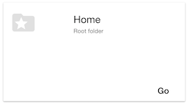

== Assignment 2

In this assignment, we're going to get the contents(items) of the root folder resource.

=== View
In the application, this root folder contents are fetched when the logged in user navigates to the 'Documents' View
and clicks the 'Go' button in the card for 'Home'

`src/modules/content/content.html`
[source,html]
<md-button ng-disabled="!vm.rootFolder" ng-click="vm.showHomeFolder()">Go</md-button>

=== Controller
`src/modules/content/content.controller.js` +
In the content controller we load the folder resource in the following manner

[source,javascript]
  showHomeFolder() {
    ...
    this.folderService
      .fetchContent(this.rootFolder)
      .then((items) => {
        this.contentlist = items;
      })
      ...
    ;
  }

=== Service
==== Assignment:
The following function is to fetch and return the result of the . Right now it returns empty.
Details of the required implementation are in the function comments

Location: `src/services/folder.service.js`
[source,javascript]
    /**
     *TODO Assignment : Implement this method
     * 1. Use the GET method on the 'items' link of the folder resource
     * 2. Modify the url to set a filter on the owner field to the current user's email (present in the user object)
     *      Modify the url to use the local nodejs proxy at localhost:3434
     *      instead of directly hitting the CMS at localhost:8080
     *      hint - use switchToProxyUrl convenience method in this class
     * 3. Return the response data items (data._embedded.itemResourceList)
     *
     * @param folder
     * @param user
     * @returns {*}
     */
    fetchContent(folder: Object = {}, user: Object = {}) {
        return this.$q.resolve([]);
    }
